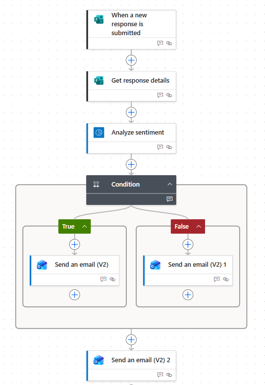

# AI Request Triage System
### Intelligent internal request routing using Microsoft Power Automate, AI Builder & NLP


---

## At a Glance

| | |
|---|---|
| **Problem** | Manual request triage is slow, inconsistent, and misses urgent submissions |
| **Solution** | End-to-end automated pipeline with NLP sentiment analysis and conditional routing |
| **Time saving** | ~2.5 hrs/day → ~15 mins/day for 20 requests **(90% reduction)** |
| **Governance** | Dual-trigger logic, human oversight at every output, full audit trail |
| **Environment** | 100% Microsoft 365, GDPR compliant, no third-party data transfer |

---

## Overview
An end-to-end no-code AI automation pipeline that intelligently triages internal workplace requests using natural language processing. The system analyses the sentiment of submitted requests, applies conditional routing logic, and automatically escalates urgent or distressed submissions while eliminating manual processing entirely.
This project demonstrates how pre-trained NLP models can be integrated into real business workflows with appropriate governance and human oversight controls.


---
## The Problem
Organisations processing large volumes of internal requests face a common challenge:

- Admin staff spend hours manually reading, judging urgency, and forwarding requests
- Urgent or emotionally distressed messages are not always identified promptly
- No consistent process as routing depends on individual judgement
- No audit trail unless manually maintained

**Estimated manual processing time: ~2.5 hours per day for 20 requests**

## The Solution

A four-stage automated pipeline:

**Routing logic (dual-trigger):**
- If AI detects **negative sentiment** → URGENT email to department
- If submitter selects **High urgency** → URGENT email to department
- Otherwise → Standard email to department
- Confirmation email sent to submitter in all cases
- Every submission logged to SharePoint audit trail

**Estimated automated processing time: ~15 minutes per day for 20 requests**
**Estimated time saving: 90%**

### Full flow overview



## Architecture

| Component | Tool | Purpose |
|---|---|---|
| Trigger | Microsoft Forms | Captures staff request submissions |
| Data retrieval | Power Automate | Pulls all form field responses |
| AI model | AI Builder (Sentiment Analysis) | NLP classification of message tone |
| Routing logic | Power Automate Condition | Dual-trigger: sentiment OR urgency |
| Notifications | Outlook (V2) | Department routing + submitter confirmation |
| Audit trail | Excel (SharePoint) | Logs all submissions for governance |


### AI Model Detail

The sentiment analysis uses Microsoft AI Builder's pre-trained NLP model, which applies transformer-based text classification to return one of three outputs:

- **Positive** - constructive or satisfied tone
- **Neutral** - factual, no strong emotional content  
- **Negative** - frustration, dissatisfaction, or urgency detected

---
## Governance & Responsible AI Design

This project applies responsible AI principles throughout, not as an afterthought, but as a core design constraint.

### Why dual-trigger logic?
A known limitation of sentiment models is that a calm but time-sensitive message may not register as negative. The dual-trigger condition addresses this: submitters can manually flag High urgency, ensuring the system catches what the AI might miss.


### Human validation points
- Every output is an email to a human inbox, no autonomous action is taken
- The URGENT flag signals priority but the human decides the response
- No direct action is taken on the submitter's behalf without human involvement

### Audit trail
Every submission is logged to a SharePoint Excel file with:
- Submission timestamp, submitter name and department
- Request title and description
- Urgency level selected by submitter
- AI sentiment classification output
- Routing pathway taken


### Excel audit trail


### Data compliance
All data remains within the Microsoft 365 environment. No data is transmitted to third-party services. AI Builder operates within Microsoft's GDPR-compliant cloud infrastructure.

---

## Risk Analysis

| Risk | Likelihood | Impact | Mitigation |
|---|---|---|---|
| AI misclassification | Medium | Low | Human reviews all URGENT emails before action |
| False negative (urgent but calm tone) | Medium | Medium | Dual trigger includes manual urgency field |
| Over-reliance on automation | Low | Medium | Regular audit log review, spot checks |
| Sensitive content misrouting | Low | High | Separate confidential pathway (future improvement) |
| Model accuracy on unusual language | Medium | Low | Structured form fields guide clearer submissions |

---

## Test Scenarios

Three test scenarios were run to validate the flow:

**Test 1 - Negative sentiment detected**
> *"We are short-staffed and unable to complete some urgent tasks. Please provide some help."*
- AI output: Negative
- Route: URGENT email

### URGENT email received


**Test 2 - Neutral / positive message**
> *"Can you provide some new training on AI"*
- AI output: Positive
- Route: Standard email

 ### Standard email received


**Test 3 - Calm message, High urgency selected**
> *"Please could someone look at the server issue. It is affecting today's deadline."*
- AI output: Neutral
- Urgency field: High
- Route: URGENT email ✓ (dual trigger working correctly)

 

### Test run - succeeded

---

## Key Learnings

- Pre-trained NLP models are highly effective for sentiment classification but require human safeguards for edge cases
- Dual-condition logic significantly improves routing reliability over single AI-only decisions
- Governance design (audit trails, human checkpoints, fallback routing) is as important as the automation itself
- No-code tools like Power Automate allow data scientists to deploy AI models into production environments rapidly without infrastructure overhead

---

## Skills Demonstrated

`Natural Language Processing` `Sentiment Analysis` `Responsible AI` `AI Governance`  
`Process Automation` `No-Code AI Deployment` `Microsoft Power Automate` `AI Builder`  
`Microsoft Forms` `SharePoint` `Excel` `Outlook` `Microsoft 365` `GDPR Compliance`  
`Risk Analysis` `Audit Trail Design` `Human-in-the-Loop Design`

---
## Relation to Data Science & AI Governance

This project applies MSc Applied Data Science concepts in a live deployment context:

- **NLP:** transformer-based sentiment classification in a real workflow
- **Model limitations:** understanding where pre-trained models fail and designing mitigations
- **Pipeline design:** structured data flow with validation at each stage
- **Responsible AI:** governance, human oversight, GDPR compliance, and auditability
- **ISO 42001 alignment:** risk-based approach, human oversight controls, and audit trail reflect ISO 42001 AI management system principles

---


## Files in This Repository

```
├── README.md                                  — This file
├── Workflow_Automation_Design_Document.docx   — Full design document
├── screenshots/
│   ├── full_flow_overview.png                 — Complete flow in Power Automate
│   ├── run_history_succeeded.png              — Successful test run evidence
│   ├── urgent_email_received.png             — URGENT routing email output
│   ├── standard_email_received.png           — Standard routing email output
│   └── excel_audit_log.png                   — Audit trail in Excel
```

---

## Author

**Zubeen Khalid**  
MSc Applied Data Science Distinction - Anglia Ruskin University  
ISO 42001 Certified | AI+ Foundation | Prompt Engineering Level 1  

[LinkedIn](www.linkedin.com/in/zubeenkhalid) · [GitHub](https://github.com/zubeen84)
